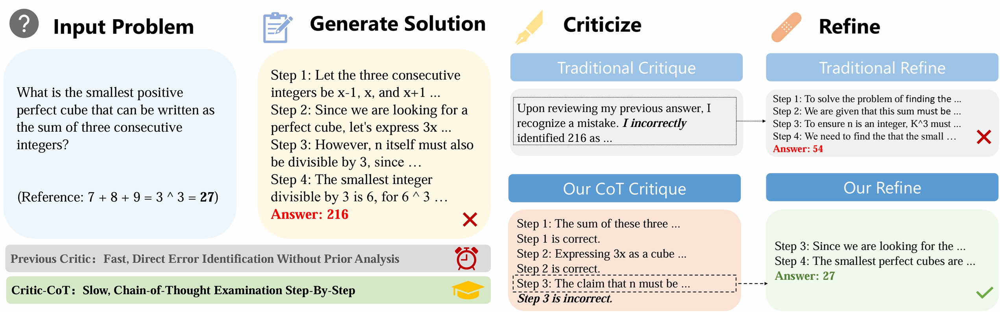

# Critic-CoT: Boosting the Reasoning Abilities of Large Language Model via Chain-of-Thought Critic
<p align="center">
  📄 <a href="https://arxiv.org/abs/2408.16326" target="_blank">Paper</a> &nbsp; | &nbsp;
  🤗 <a href="https://huggingface.co/datasets/ExpectoZX/critic_cot" target="_blank">Dataset</a> &nbsp; | &nbsp;
  📝 <a href="#citation-" target="_blank">Citation</a> &nbsp; 
</p>

Self-critic has become a crucial mechanism for enhancing the reasoning performance of LLMs. However, current approaches mainly involve basic prompts for intuitive instance-level feedback, which resembles System-1 processes and limits the reasoning capabilities. Moreover, there is a lack of in-depth investigations into the relationship between LLM's ability to criticize and its task-solving performance. To address these issues, we propose Critic-CoT, a novel framework that pushes LLMs toward System-2-like critic capability. Through a step-wise CoT reasoning paradigm and the automatic construction of weak-supervision data without human annotation, Critic-CoT enables LLMs to engage in slow, analytic self-critique and refinement, thereby improving their reasoning abilities. Experiments on GSM8K and MATH and out-of-domain evaluation demonstrate that our enhanced model significantly boosts task-solving performance by filtering out invalid solutions or iterative refinement. Furthermore, we investigate the intrinsic correlation between critique and task-solving abilities within LLMs, discovering that these abilities can mutually reinforce each other rather than conflict.




## Citation
```bibtex
@article{zheng2024critic,
  title={Critic-cot: Boosting the reasoning abilities of large language model via chain-of-thoughts critic},
  author={Zheng, Xin and Lou, Jie and Cao, Boxi and Wen, Xueru and Ji, Yuqiu and Lin, Hongyu and Lu, Yaojie and Han, Xianpei and Zhang, Debing and Sun, Le},
  journal={arXiv preprint arXiv:2408.16326},
  year={2024}
}
```